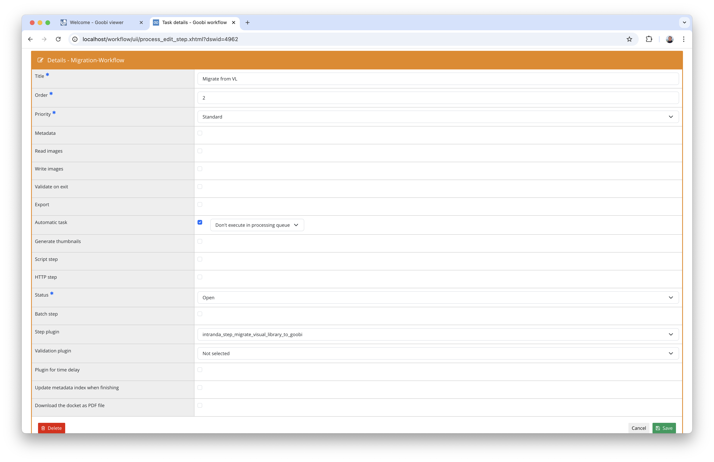
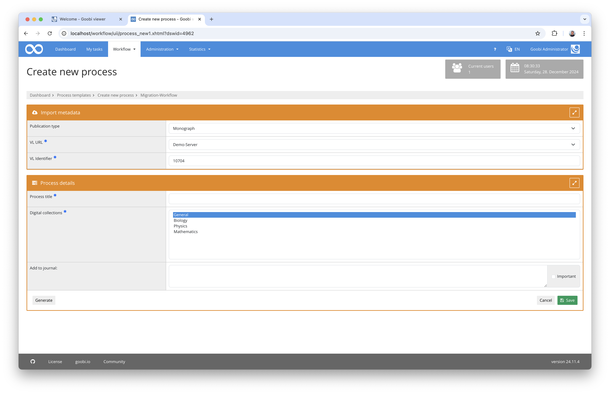
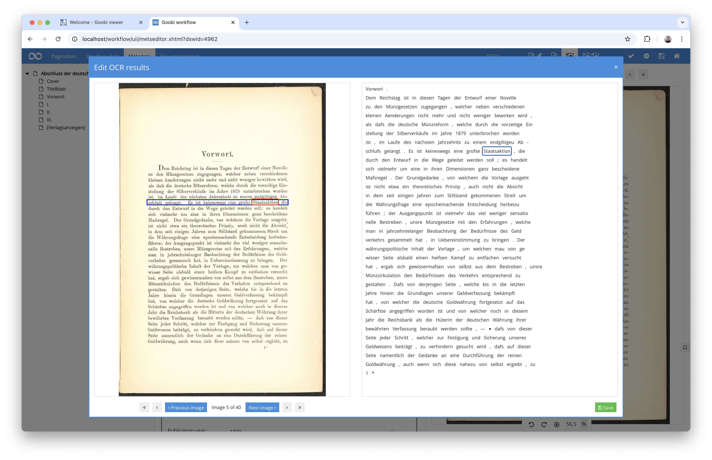
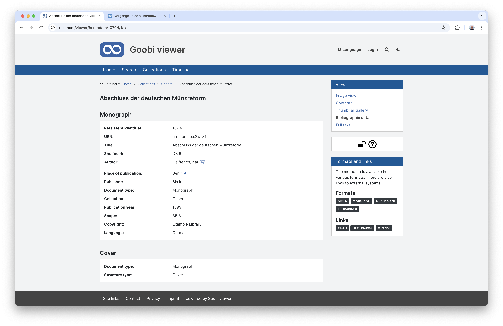
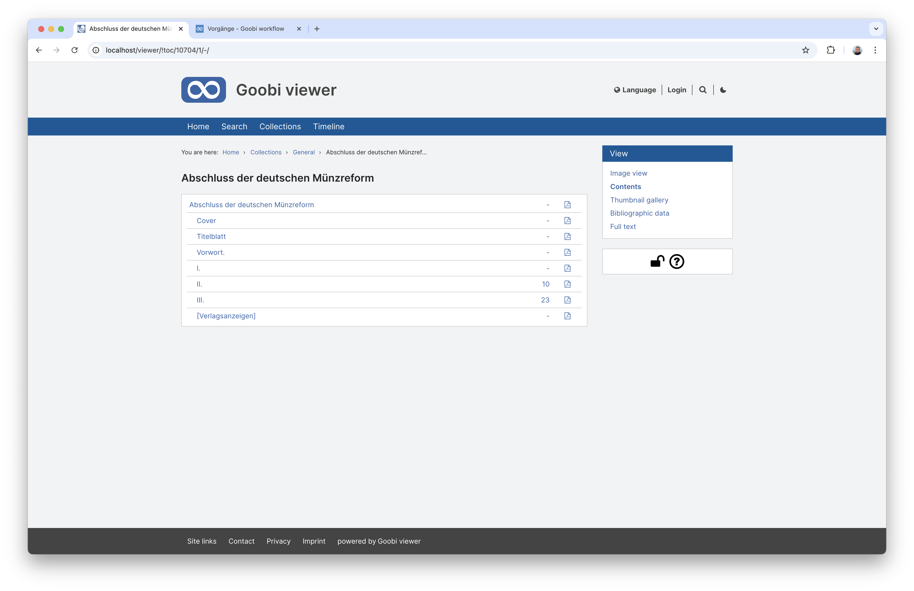

## Introduction
This documentation explains the plugin for automatic data transfer of digitised data from a Visual Library instance to Goobi workflow. The publicly accessible METS file is retrieved from the Visual Library system. The metadata, structural data, pagination, images and full texts are then transferred from this file. Immediately after the data transfer, the works can be published in the Goobi viewer.

## Installation
To be able to use the plugin, the following files must be installed:

```bash
/opt/digiverso/goobi/plugins/step/plugin-step-migrate-visual-library-to-goobi-base.jar
/opt/digiverso/goobi/config/plugin_intranda_step_migrate_visual_library_to_goobi.xml
```

Once the plugin has been installed, it can be selected within the workflow for the respective work steps and thus executed automatically. A workflow could look like the following example:


To use the plugin, it must be selected in one step:




## Overview and functionality
After starting the plugin, it first initialises itself with information from the configuration file. The plugin then uses a configured property to determine which OAI interface should be used to query a METS file. 



The METS file is then downloaded and all relevant metadata is extracted from it and transferred to the corresponding METS file in Goobi. The same is done for the structural data and the pagination sequences. 


Finally, the plugin starts downloading the images from the `MAX` file group in order to download the best available quality of the derivatives. If full texts in `ALTO` format are available for the requested works, these are also downloaded and saved in the Goobi process.



After successful import, the works can then be further processed and published in the Goobi viewer, for example.






## Configuration
The plugin is configured in the file `plugin_intranda_step_migrate_visual_library_to_goobi.xml` as shown here:

{{CONFIG_CONTENT}}

{{CONFIG_DESCRIPTION_PROJECT_STEP}}

Parameters              | Explanation
------------------------|------------------------------------
`vl-url`                | Specification of the transaction property containing the URL of the OAI interface. This property is expected to contain a URL such as `https://visuallibrary.net/ihd4/oai/?verb=GetRecord&metadataPrefix=mets&identifier=`
